# Debuger and debugging

Когато един кратък и логически прост код се счупи, е лесно да се провери от къде идва грешката. Принтираме наред всичко на конзолата и следим ред по ред това, което е излязло, дали съответства на това, което искаме. И така по хамалския начин проверяваме, какво се случва. Но ако кодът е сложен и обемен, човек много трудно може да разбере къде е проблемът и защо се появява. Да не говорим, че писането на cout-ове след всеки изпълним ред става досадно след 15-ия път (а трябва и да ги трием после).

Тук дебъгерът идва на помощ. Той е ключов инструмент, чийто механизъм помага да се вижда във всеки един момент как се изпълнява програмата и какви стойности има даден обект или променлива. Впоследствие ще видите, че голяма част от времето за писане на програма отива в оправяне на грешки в кода. А с дебъгера може да си спестите време и най-вече нерви, което ще направи работата ви доста по ефективна.

Ще разгледаме дебъгера на  Visual Studio, но нещата, които се отнасят за него, важат до голяма част и за останалите среди.

Дебъгера се пуска чрез бутона от лентата или от менюто Debug->Start Debugging. Също така и със стандартната клавишна комбинация F5. Това стартира вашата програма в режим на дебъгване (с Ctrl + F5 само стартирате програмата).

Забележка: Тези команди първо компилират кода и след това изпълнява крайната програма.

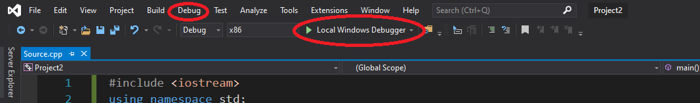

Дебъгерът ще си изпълнява програмата докато достигне до червена точка, наречена breakpoint, сигнализираща й, че от тук програмиста желае да поеме контрол над изпълнението ѝ.

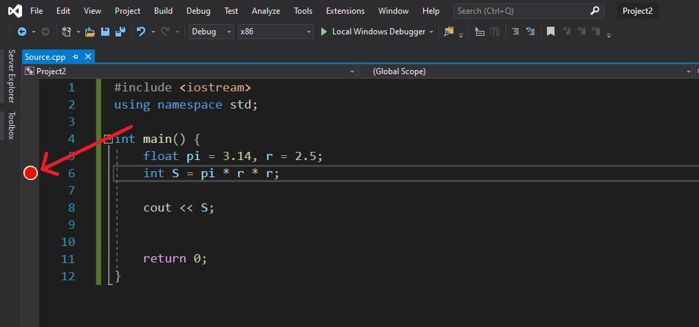

След включването на дебъгера и достигането до breakpoint средата бележи текущия ред за изпълнение със стрелкичка. Също така ни предоставя и няколко нови опции в лентата с инструменти, чрез които да управляваме изпълнението на кода:

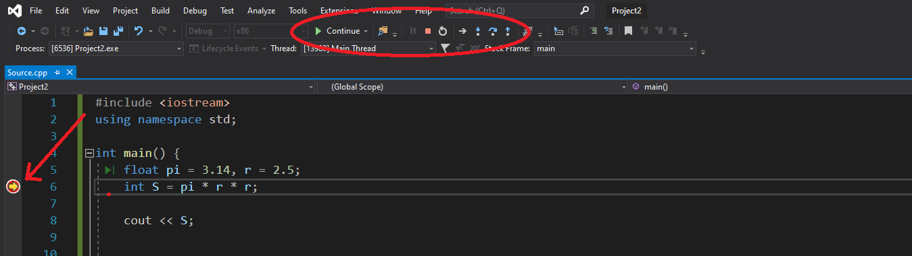

<ul>
<li style="margin: 10px 0;list-style-type: square;">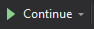 - (Continue) Продължаване на изпълнението на програмата в режим на дебъгване </li>
<li style="margin: 10px 0;list-style-type: square;">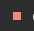 - (Stop Debugging) Прекратяване на дебъгването и изпълнението на програмата </li>
<li style="margin: 10px 0;list-style-type: square;">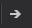 - (Show next statement)Препраща курсора на позицията на текущия ред за изпълнение (ако случайно се затриете къде сте)</li>
<li style="margin: 10px 0;list-style-type: square;">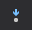 - (Step into) Ако текущия ред за изпълнение зависи от извикване на функция, то влизате във функцията. Това не важи за някои функции от стандартната библиотека, но винаги важи за ваши функции.</li>
<li style="margin: 10px 0;list-style-type: square;">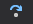 - (Step over) Ако текущия ред за изпълнение зависи от извикване на функция, то не се влиза във функцията. Просто се изчислява какъв резултат ще върне и продължавате на следващия ред.</li>
<li style="margin: 10px 0;list-style-type: square;">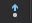 - (Step out) Функцията се изпълнява до край и дебъгването почва от там където е била извикана</li>
</ul>

Освен контрол над изпълнението на изпълнимите редове режимът на дебъгване позволява и наблюдение на стойностите на обектите в текущия програмен блок от код. 

Първия вариант е като използвате курсора (фиг 1) и посочите името на обекта, който искате да видите. За обекти, които не са от вграден тип, стойностите им се изписват в падащ списък. Това важи и за техните стойности, ако от своя страна и те са обекти (фиг 4 и 5). Забележка(фиг 2 и 3): ако масива не е константен то дебъгера ще покаже стойността му само като адрес и какво се намира на този адрес(фиг 3). Също така това може да варира и от среда до среда и дори и константните масиви да се изписват така. След малко ще видим как да се справим с този проблем.

 
фиг 1

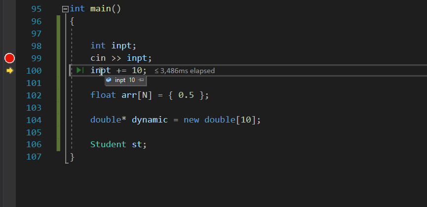
 
фиг 2

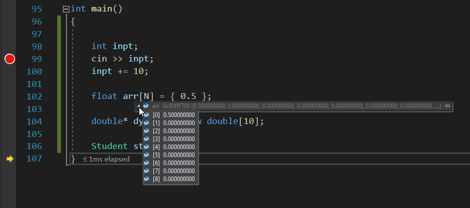
 
фиг 3

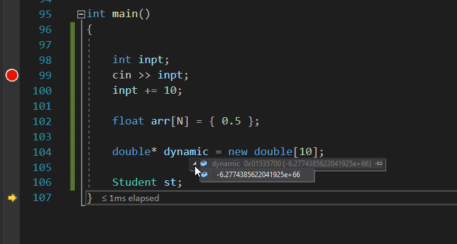
 
фиг 4

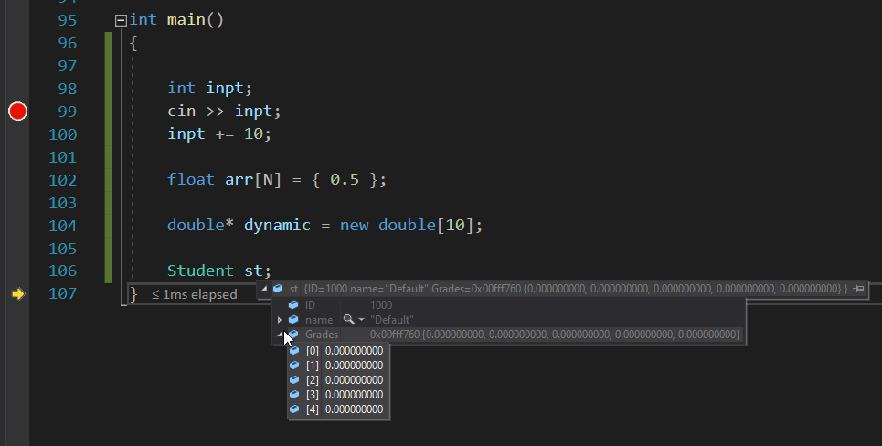
 
фиг 5

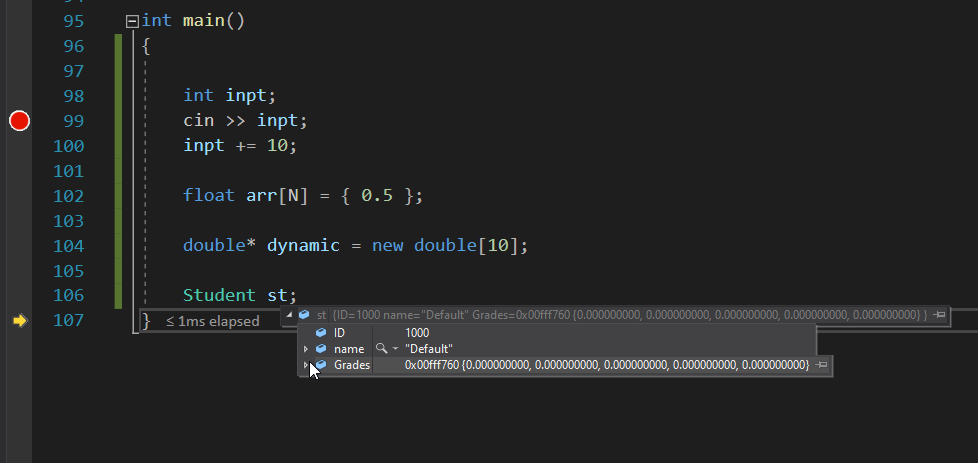

В прозореца (фиг 6), който се появява по време на дебъгване под вашия код, може да наблюдавате същите данни без да има нужда от използване на курсор. В прозорците Autos и Locals ще намерите данните, които Visual Studio смята за нужни (текущи променливи в блока от кода).

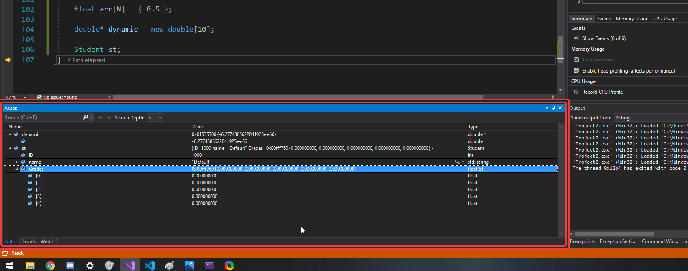

 С кликане на десен бутон и избиране Add Watch може да добавите свой прозорец, където можете да правите ваши собствени изрази, които да се изчисляват по време на работа. Ако напише просто променливата то ще изпише нейната стойност. Може да правите и различни елементарни изчисления с група от променливи. Но най-удобното на тази система е това, че може да изписвате стойността на масив (или подмасив) чрез аритметичните операции с указатели.

 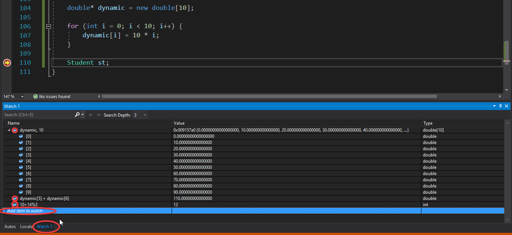

 Изписването на стойности на масив става с изписване на името на масива(началния адрес) следвана от запетая и число, което оказва колко елемента след началния да изпише.

 Повече информация може да намерите на:

 * Visual Studio debugger documentation - https://docs.microsoft.com/en-us/visualstudio/debugger/?view=vs-2019
