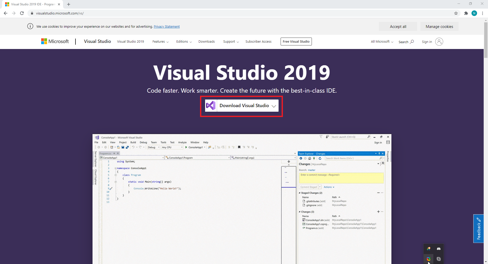
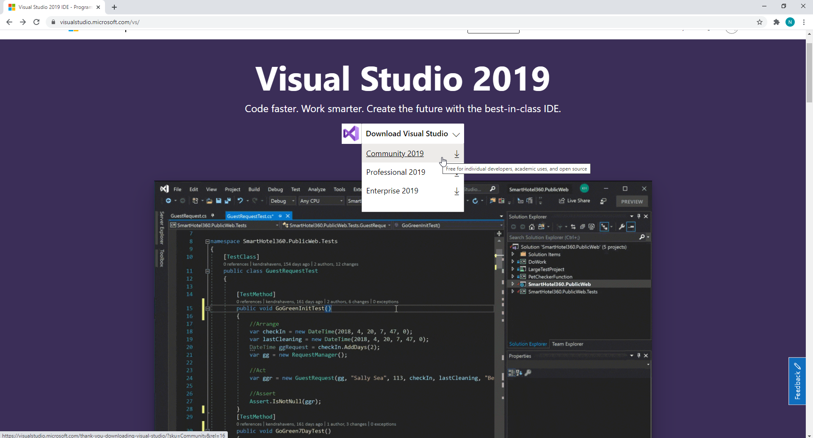
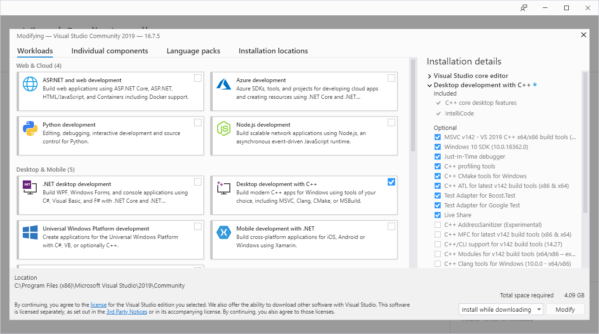

# Инсталиране на интегрирана среда за програмиране (IDE) Visual studio

В практикума по УП ще работим основно със средата за програмиране (**I**ntegrated **D**evelopment **E**nvironment) Visual Studio. Съществуват и други среди, но тази ви я препоръчваме, защото нещата до известна степен са автоматизирани (и при инсталационен процес и по време на работа).

Сваляте инсталатора на Visual Studio IDE и инсталирате. Може да продължи плашещо дълго, в зависимост от добавките към него, затова препоръчваме C++ development kit-a за УП, ООП и СД-то във ФМИ.

Изберете да изтеглите средата и от падащото меню избере **Comunity** версията. По принцип от СУ имате право да ползвате платен Profesional от elms.fmi.uni-sofia.bg

След като инсталатора си свърши работата, имате пълната свобода да кодите на воля. Ако нещо сме изпуснали, питайте!

Айде весело!
