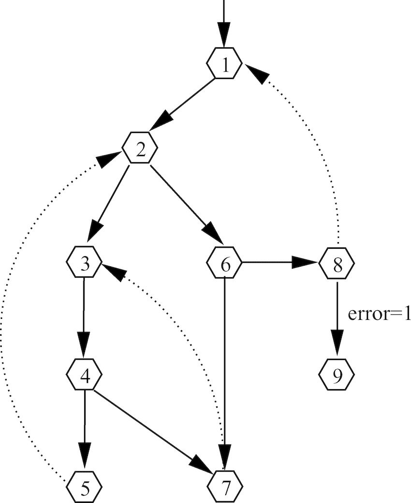
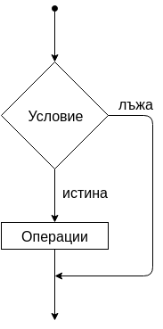
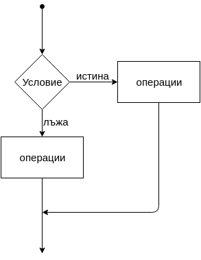

## С какво ще се занимаваме днес?
- Булеви изрази
- Scope(видимост на данните), тяло
- Условен оператор `if`/`else if`/`else`
- Тернарен оператор :?
- Условен оператор `switch`
- Библиотеки и `using namespace`

# Булеви изрази
Използваме булеви изрази тогава, когато искаме да видим дали дадено нещо е истина или лъжа. Типът на един булев израз е `bool`. Булевите изрази могат да бъдат само с едно условие или няколко условия.

## Едно условие
За пример можем да дадем сравнението на две числа:
```cpp
std::cout << 2 > 3; // -> 0
std::cout << 2 < 3; // -> 1
std::cout << 2 == 3; // -> 0
std::cout << 2 != 3; // -> 1
```
> Както знаем от предишния път, операторите за сравнение връщат `bool` (Истина или лъжа).

## Няколко условия
Тук вече ще се възползваме от логическите оператори, които рзгледахме миналият път. Те се изпозлват, когато искаме да сравним няколко условия на веднъж. Накратко се използва конюкция(логическо И) и дизюнкция(логическо ИЛИ). Спокойно, дори да не ги разберете в момента, ще ги упражните в часовете по дискретни структури. Ето един пример:
```cpp
int x = 1;
int y = 10;
int z = 3;

std::cout << (x > y) && (z > x);
std::cout << ((x == x) && (y == y)) || x == z;
std::cout << ((x == x) && (y == z)) || x;
std::cout << ((x > y) && (z > x)) || (y > x && z < x);
std::cout << ((x == x) && (y == z)) == x;
```

Както виждате можем да комбинираме различни оператори и да създаваме сложни условия. Но поставянето им не е произволно. Тези оператори си имат преиоритет, като конюнкцията(`&&`) има по-висок преоритет от дизюнкцията(`||`).
Така примерно следният код:
```cpp
bool isCorrect = x + y < z || x > z && y < z;
```
Има реално следният вид:
```cpp
bool isCorrect = (x + y < z || (x > z && y < z));
```

> Препоръчително е при писане на кода, да слагате скоби, които да помагата с приоритета на операциите. Не само е добра практика, а и кодът ви става доста по-лесен за четене.

> Защо `std::cout << 1 > 2;` връща `0` вместо `false`? Това е така по стандарт на езика, ако искаме да изкараме текст за истина или лъжа, можем да използваме `std::boolalpha`:  
`std::cout << std::boolalpha << 1 > 2;`

# Видимост на данни(Scope, Блок)
Блок в една програма наричаме парче код, което е заградено от фигурни скоби(`{}`). Има две основни конвенции за писане на скобите и е хубаво да си харесате една от тях и да я следвате:

```cpp
if(){
    std::cout << "First option";
}

// или

if()
{
    std::cout << "Second option";
}
```

## Видимост на променливите
Това е частта от програмата в която можем да достъпим дадените променливи. Видимостта, спрямо това как се разглежда я разделяме в 3 категории:
- Променлива, която е във функция или блок, се нарича локална променлива
- Проемнлива в дефиниця на фунцкия се нарича формален параметър
- Променлива извън всички фунцкии се нарича глобална променлива

**Локалните променливи са видими единствено и само за блока в който са декларирани и всеки подблок. Точно заради това глобалните променливи са дефинирани извън блок и имат достъп до всеки блок в програмата ни.**

Пример:
```cpp
// Глобална променлива
int myGlobal;

{
    // Локална променлива
    int local;

    {
        // Още една локална променлива
        int anotherLocal;

        {
            // И още една локална променлива
            int lastLocal;

            myGlobal = 12;
        }

        lastLocal = 69; // Грешка
    }

    local = 88;
    anotherLocal = 99; // Грешка
    myGlobal = 404;
}
```

>Лоша практика е използването на глобални променливи! Избягвайте ги винаги, когато е възможно. Ако ги използвате, използвайте ги разумно!

# Условен оператор `if`/`else`/`else if` (if - statement)

Control flow(контрол на потока) e редът на изпълнение на предефинирани инструкции в една програма. Редът на изпълнение на една програма може да е различен в зависимост от различни условия.
Например в зависимост от това, какви данни е въвел потребителя програмата може да изпълнява различни инструкции.<br>
По време на изпълнение на програмата тези условия се изчисляват и се решава, по кой клон да протече изпълнението на програмата.



>Винаги програмата започва от 1, като според взетите решения можем да приключим програмата в 5, 7 или 9.

## if

Единият от начините чрез, който може да се разклони изпълнението на програмата е използвайки if условният оператор. Ето как изглежда той:

```cpp
if(<условие>)
{
    // Тяло на if
}
```

>Проверява се условието, което е в скобите и ако резултатът е истина, то ще се изпълни кодът в тялото.

Пример:
```cpp
int age;

std::cin >> age;

if(age < 18)
{
    std::cout << "Sorry, you can not enter EXE, you're still a kid!";
}

return 0;
```



## Пълна форма на if

Често имаме нужда да проверим за дадено условие и ако то не е изпълнено да извършим някакво друго действие.
Това става с помощта на `else` оператора.

```cpp
if(<условие>)
{
    // Тяло на if
}
else
{
     // Тяло на else
}
```
>Ако условието ни в if е лъжа, то тогава, ще се изпъкни кода в тялото на `else`

**!!Важно!! Не можем да имаме `else` без `if`.**



Нека разширим по-горния код:

```cpp
int age;

std::cin >> age;

if(age < 18)
{
    std::cout << "Sorry, you can not enter EXE, you're still a kid!";
}
else
{
    std::cout << "Damn, you are old enough to enter! Have fun!";
}

return 0;
```

## else if

Някой път едно условие `if` и всички останали случаи `else` не са достатъчни за да изградим логиката на едно приложение.
Често се налага да се изпълни едно парче код измежду множество условия.

За това може да използваме `else if` оператора.

```cpp
if(<условие>)
{
    // Тяло на if
}
else if(<условие>)
{
     // Тяло на else if
}
```

>Тук имаме две условия за сравняване. Първо ще провери условието в `if` и ако то е лъжа, ще се провери условието в `else if`. Ако нито едно от двете не е вярно, то тогава няма да се изпълни никакъв код.

>Отново е възможно да се добави `else` към тях.

> И разбира се, възможно е изписваме вложени `if`-ове.

**Интересен факт:**
Всъщност не съществува оператор `else if`.
Нещото което реално се случва е следното:

```cpp
if(<условие>)
{
    // Тяло на if
}
else 
{
    if(<условие>)
    {
        // Тяло на else if
    }
}
```
Но `else if` е по-разбираемо и по-лесно за ориентиране в кода.

Примерна програма:
```cpp
#include <iostream>

int main()
{
    unsigned int age;
    std::cin >> age;

    if (age < 18)
    {
        std::cout << "You are a kid";

        if (age < 5)
        {
            std::cout << "Gu-gu ga-ga";
        }
    }
    else if (age < 30)
    {
        std::cout << "You are a young adult";
    }
    else if (age < 60)
    {
        std::cout << "You are an adult"
    }
    else if (age < 110)
    {
        std::cout << "You are an elderly fella";
    }
    else
    {
        std::cout << "How tf are you even alive bruh? :x"
    }

    return 0;
}
```

# Тернарен оператор `:?`

Много наподобява конструкцията `if(){} else{}`. Формално този оператор се нарича **тернарен оператор**.

Притежава следния синтаксис:
`<условие> ? <оператор при истина> : <оператор при лъжа>`

Изислява се условието(булевият израз), като след това се изпълнява:
- частта след `?`, ако условието е истина
- частта след `:`, ако условието е лъжа

Пример:
```cpp
int  main()
{
    int age;
    std::cin >> age;

    bool isOldEnough = age > 18 ? true : false;
}
```

# Условен оператор `switch`

`if else` не е единственият начин за изграждане на условия в C++. Езикът предлага и друга конструкция за постигане на същия резултат, която се нарича `switch case`.

```cpp
int x = 69;
        
switch (x) {
    case 1:
        std::cout << "It's 1";
        break;
    case 2:
        std::cout << "It's 2";
        break;
    case 69:
        std::cout << "Haha, very funny, dumbass!";
        break;
    case -404:
        std::cout << "Answer not found??!!";
        break;
    default:
        System.out.println("Neither 1 or 2 or 69 or -404");
        break;
}
```

>В този случай, ще се изкара не екрана "Haha, very funny, dumbass!"

Това което е по-характерно за `switch case`, e че тялото което ще бъде изпълнено зависи от стойността която е подадена на оператора `switch(...)`. В зависимост от стойността на променливата в `switch`, оператора решава кой `case` да бъде изпълнен.
**Важно** е да се отбележи, че всеки `case` завършва с ключовата дума `break`. Това ще прекрати изпълнението на целия switch case и ще се продължи с кода след него. Ако липсва `break`, то тогава ще се продължи с изпълнението на следващият case, независимо дали той е спазен или не. 
`switch case` операторът също така има еквивалент на `else` оператора в `if` условията. Този еквивалент е ключовата дума `default`.

Ето как би изглеждал горният пример написан с условният оператор `if`:

```cpp
int x = 69;
        
if (x == 1)
{
    std::cout << "It's 1";
}
else if (x == 2)
{
    std::cout << "It's 2";
}
else if (x == 69)
{
    std::cout << "Haha, very funny, dumbass!";
}
else if (x == -404)
{
    std::cout << "Answer not found??!!";
}
else
{
    std::cout << "Neither 1 or 2 or 69 or -404";
}
```

Това дали ще се използва `if else` или `switch case` често е субективно решение. Обикновенно `switch case` се предпочита, когато се налага да се вземе решение измежду краен брой константи възможности. Например дали човек е от мъжки или женски пол.

# Библиотеки и using namespace

Библиотеките се използват тогава, когато ни трябва да използваме вече написан код от някой файл. Обикновено бибилтиотеките са такива файлове с код, който не е написан от нас и често прибавя променливи, фунцкии и шаблони към кода ни. Някои от тези неща не ни трябват и тук се включват така неречените `namespace`-ове. Те служат за разграничаване на дадена фунционалност от кода. Примерно `<iostream>` е библиотека, която включва страшно много код, повечето от които няма да използваме. Така примерно ако имаме фунцкия с име `cout` и вкараме библиотеката `<iostream>`, програмата ни няма да се бърка кой `cout` използваме така, като нашият `cout` извикваме нормално, а `cout` който е в `<iostream>` се извиква по следният начин `std::cout`.<br>

Сега вече идва проблема ако включим `using namespace std`. Това ни позволява да извикваме `std::cout` без да пишем `std::` отпред. Да, но това е проблем. Сега ако извикам `cout`, дали ще извикам този, който е дефиниран от мен или ще викна този, който е дефиниран от `<iostream>`. Затова е лоша практика използването на `using namespace std`.