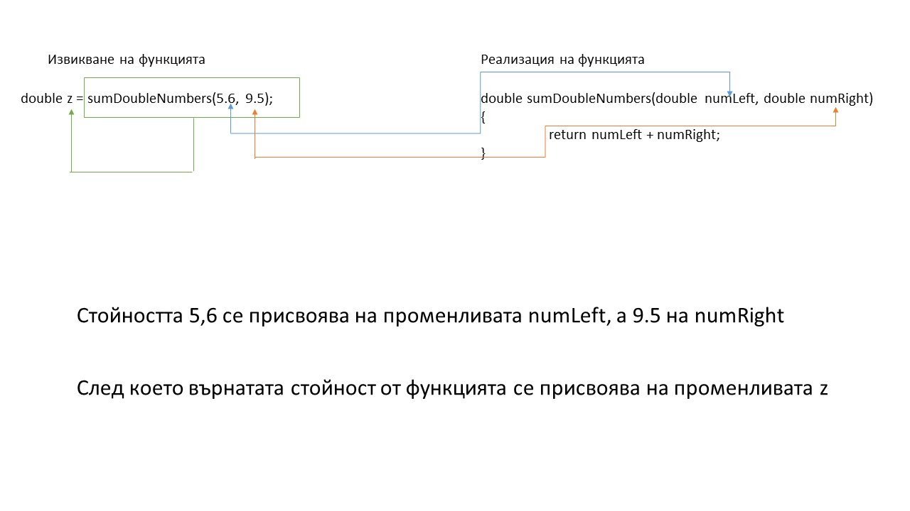

## Функции(Functions)
### Какво са функциите и за какво ги използваме
Функциите позволяват структуриране на програмата на сегменти, които да извършват индивидуални задачи. Можем да кажем и така: Функцията е група от оператори, на коята се дава име и може да бъде извикана в коя да е част от програмата ни.

Главните цели на функциите са:
 - да разделим изпълнението на главната ни задача на подзадачи (опростяване на заданието)
 - избягването на повторение на код
 - подобряване на четливостта на кода

### Основни понятия
Тук ще разграничаваме следното:
 - декларация (declaration) на функция - казва на компилатора за това, че съществува функция с: име, тип на връщане и параметри към функцията
 - дефиниция (definition) на функция - тук е указва какво точно е тялото на функцията (т.е нейната реализация)

### Синтаксис
#### Основният синтаксис на функция, при нейната дефиниция е:

```c++
return_type function_name( parameter_list )
{
   body_of_the_function
}
```

където:
 - **return_type (върнат тип)** - посочва какъв ще е типът на върнатата стойност от функцията
 - **funtion_name** - това е името на функцията. Чрез него ще можем да се обръщаме към самата функция, когато искаме тя да се изпълни
 - **parameter_list** - списък от параметри, които се подават на функцията. Този списък не е задължителен, т.е можем да имаме функция,
    която **не** приема параметри. Ако такъв съществува, то те са изписани по модела: **<тип> име | <тип> име = стойност**
 - **body_of_the_function (тяло на функцията)** - правилата, по които ще се изпълни дадената функция

Пример:
Ще направим програма, която ще намира сумата на две цели числа:

```c++
#include <iostream>

int sum(int numLeft, int numRight)
{
    return numLeft + numRight;
}

int main()
{
    int result = 0; // добра практика е да се инициализира стойността при създаване, за да не се запълва с някаква случайна стойност

    result = sum(4, 5);

    std::cout << "Sum = " << result;

    return 0;
}
```

Тази функция ни казва следното: **типа на върнатата стойност** ще бъде тип **int**, **името на функцията е sum** и тя ще **приема две цели числа.** В главната функция (main функцията) създаваме променлива, в която ще запаметим резултата от сумирането. Обърнете внимание, че използвам същия тип като на функцията (int). Трябва да подадем две стойностти на функцията в случая са 4 и 5. След това изкарвам резултата, който в случая е 9.

### Декларация на функция
Декларирането на функция единствено казва на компилатора, че имаме дадена функция, без да казва как е реализирана тя.

Пример:

```c++
return_type function_name( parameter list);
int sum(int numLeft, int numRight);
```

Така нашата програма ще знае, че съществува функцията sum, която има два параметъра, но до там. Как е реализирана функцията, трябва да кажем допълнително. При някой конвеции на езика е препоръчително декларацията да се намира **преди main функцията**.

### Дефиниция на функция
Дефинирането на функция всъщност е точно това допълнителноо нещо, което казваме на компилатора. Дефиницията представлява реализация на функцията или по-просто казано, това е **съдържанието на тялото** на функцията - функционалността на функцията.

Пример:
```c++
int sum(int numLeft, int numRight)
{
    return numLeft + numRight;
}
```

Пример за използване на декларация и дефиниция:

```c++
#include <iostream>

int sum(int numLeft, int numRight);

int main()
{
    int result = 0; // добра практика е да се инициализира стойността при създаване,
    		    // за да не се запълва с някаква случайна стойност

    result = sum(4, 5);

    std::cout << "Sum = " << result;

    return 0;
}

int sum(int numLeft, int numRight)
{
    return numLeft + numRight;
}
```
Така казваме, че има функция sum и при изввикването и в главната функция, програмата ще търси къде е дефиницията на тази функция.

### NB!: Функциите, които казваме, че връщат тип винаги имат **return <type_component>;**
Какво точно казва това?
Когато казваме, че функцията трябва да върне реален тип, то се очаква, че ще има някъде във функцията операторът return. Той казва, че се прекратява изпълнението на функцията и ще се върне стойността която му е зададена вдясно от него.

Пример:
```c++
   return (5 + 9);
```
Ще върне целочислен резултат 14 (стига до return, смята стойността на израза и го връща като резултат)

След return може да имате и по - сложни изрази.
Пример:

```c++
bool isEven(int number)
{
  return (number % 2 == 0 ? true : false);
}

float someWeirdFunction(float number)
{
  return (number + 365 - sin(45));
}
```


### Функции, които не връщат стойност
Това са функции, чието предназначение **не очертава връщането на стойност.** Те се използват, когато искаме да въведем/променим дадена стойност или да изведем съобщение. **В тези функции пропускаме оператора return**. Разбира се, не е изключено да го използваме. Когато го използваме връщаме **нищо**-празен оператор, т.е стигаме до оператор **return;**, който прекратява изпълнението на функцията и не връща стойност. (не забравяйте, че завършва с ;)

Пример:
```c++
void message()
{
   std::cout << "This is message\n";
}

void someFunction()
{
	if (true)
	{
		std::cout << "True";
		return ;
	}
    	else
	{
		std::cout << "False";
		return ;
	}

	std::cout << "This will never show on screen";
}
```

В someFunction никога няма да се покаже последното съобщение, защото и в двата случая на логическото условие сме дали return; което ще прекрати изпълнението на функцията.

Пример с всичко до тук (програмата има само образователна цел):
```c++

#include <iostream>

int input(); // въвежда полочително число
int sum(const int numLeft, const int numRight); // извършва сумиране на числата

bool isNegative(int number); // проверява дали числото е отрицателно. Тип на връщане - bool

void message(); // Съобщение
void output(int number); // Изход с число
void lego(); // сглобяване

int main()
{
    lego();

    return 0;
}

int input()
{
    int tmp;

    do
    {
        message();

        std::cin >> tmp;
    }while(isNegative(tmp));

    return tmp;
}

bool isNegative(int number)
{
    return number < 0;
}

void message()
{
    std::cout << "Number must be positive\n";
}

int sum(const int numLeft, const int numRight)
{
    return (numLeft + numRight);
}

void output(int number)
{
    std::cout << "Result = " << number << std::endl;
}

void lego()
{
    int numLeft = 0, numRight = 0;

    numLeft = input();
    numRight = input();

    output(sum(numLeft, numRight));
}
```

Нека обърнем малко внимание на подаването на параметри във функции.
В горните примери видяхме, че при извикване на функция с параметри трябва да ги подадем, като реда на подаване има значение, т.е:

