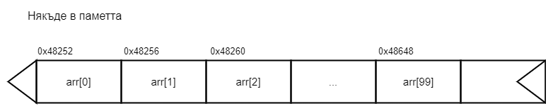

## Какво ще научим днес?
* едномерни масиви

## Масиви(Arrays)
Масивът е тип данни, представляващ крайна редица от **еднотипни елементи** с **пряк достъп до всеки елемент**. Масивът е съвкупен тип данни, който ни позволява да осъществим достъп до много променливи от един и същи тип чрез **идентификатор**. В декларацията на масива използваме квадратни скоби ([]), за да кажем на компилатора, че това е *променлива от тип масив*(вместо нормална променлива), както и колко последователни(по адреси) клетки("променливи") да се заделят в паметта(наречени дължина на масива).

```c++
int hours[100];
```

)

### Памет
Паметта е поредица от клетки, всяка от които има свой размер и адрес. Когато казваме *колко клетки("променливи") да се заделят в паметта*, имаме предвид че, в паметта трябва да има толкова свободни клетки, със съответния размер на типа на масива(променливите от този тип), колкото ние сме посочили, че да може да заемем. Например, aко пазим работните часове на 100 работника, в паметта масивът ни ще изглежда като на картинката горе.


#### Паметта, която можете да използвате в C++ програма е най-общо казано три типа:
* статична

в тази памет се записват променливите, обявени извън функциите (т.нар. глобални променливи). Те се виждат от всички функции през цялото изпълнение на програмата
* стекова

в тази памет се записват предадените параметри и променливите дефинирани вътре във функциите и въобще в произволен блок. Променливите се виждат само във функцията (блока) в която са дефинирани и се унищожават при завършване на функцията (излизане от блока)
* динамична

останалата част от паметта на компютърна е достъпна до всички програми при поискване. За управлението на тази памет се грижи операционната система  . Във всеки момент отделен блок от паметта може да е свободен или да е заделен за някоя програма, при която може да го чете само тя. При опит някоя програма да прочете памет, която не е заделена за нея, независимо дали е заделена за друга програма или е свободна, операционната система прекратява изпълнението на програмат с грешка Access Violation


### Декларане на масив
За изграждането на масив най-важното което, трябва да определим е **броят на елементите** му и **техният тип**.
​    
    int arr[5]; - така декларираме масив от тип int с 5 елемента
    double dArr[10]; - така декларираме масив от тип double с 10 елемента
    char str[100]; - така декларираме масив от тип char със 100 елемента

Броят на елементите може да бъде зададен и чрез константа, която е предварително дефинирана;
```c++
    const int n = 3;
    long array[n];
```
Достъпът до всеки елемент се осъщесвява, чрез индексирана променлива, в която са указани **името на масива** и **индексът**(поредният номер на елемента в масива) поставен в квадратни скоби.
```c++
    array[0]; // индексирането в масиви е от 0 до (броя на елементите - 1)
```
### Инициализация на масиви
##### Първи начин:

```c++
    int arr[5];
    arr[0] = 5;
    arr[1] = -3;
    arr[2] = 12;
    arr[3] = 6;
    arr[4] = 123015;
```

##### Втори начин:

```c++
    int arr[5] = {5, -3, 12, 6, 123015};
```

##### Трети начин:

```c++
    int arr[] = {5, -3, 12};
```

##### Четвърти начин:

```c++
    int arr[] = {0};
```

##### Пети начин:
Можем да  инициализираме масив и със стойности, въведени от клавиатурата.
```c++
    double arr[5];
    for(int i = 0; i < 5; i++)
        cin >> arr[i];
```

### Допустими операции
Операции над цели масиви ***не са допустими***.

```c++
    int a[5], b[5] = {1,2};
    a = b;  // недопустима операция
```

### Въвеждане и извеждане на еменетите на масив
#### Въвеждане:

```c++
    double arr[5];
    for(int i = 0; i < 5; i++)
    {
        cout << "arr[ " << i << " ]= ";
        cin >> arr[i];
    }
```

#### Извеждане:

```c++
    double arr[5];
        ...
    for(int i = 0; i < 5; i++)
    {
        cout << "arr[ " << i << " ]= " << arr[i] << endl;
    }
```

## Символен низ
Масив от тип char се нарича  **символен низ**.
Примери:
​    
     "Informacionni sistemi"
     "My name is Mery"
     "" // празен низ
     "My name" // подниз на "My name is Mery"

Низовете се използват за образуване на изречения на някой език, обработка на текстове, кодиране на информация, кодиране на команди и други.

### Декларане на символен низ
При декларирането на низ, трябва да се предвиди място за още един символ: \0 - null символ(означава край на низ). Този символ не се отпечатва, той просто дава нужната информация на компилатора.

    char str[100]; - така декларираме масив от тип char със 100 елемента

Броят на емементите може да бъде зададен и чрез константа, която е предварително дефинирана;
```c++
    const int SIZE = 3;
    char key[SIZE];
```
**Достъпът** до всеки елемент, както при другите масиви, се осъщесвява, чрез индексирана променлива, в която са указани **името на масива** и **индексът**(поредният номер на елемента в масива) поставен в квадратни скоби.
```c++
    key[0]; // индексирането в масиви е от 0 до броя на елементите -1
```

### sizeof()
Sizeof е оператор, който ни показва колко памет(в байтове) заема дадена променлива от съответен тип.
```c++
#include <iostream>
using namespace std;

int main()
{
    cout << "bool:\t" << sizeof(bool) << " bytes" << endl;
    cout << "char:\t" << sizeof(char) << " bytes" << endl;
    cout << "short:\t" << sizeof(short) << " bytes" << endl;
    cout << "int:\t" << sizeof(int) << " bytes" << endl;
    cout << "long:\t" << sizeof(long) << " bytes" << endl;
    cout << "float:\t" << sizeof(float) << " bytes" << endl;
    cout << "double:\t" << sizeof(double) << " bytes" << endl;
    cout << "long double:\t" << sizeof(long double) << " bytes" << endl;

    return 0;
}

```

	bool:		1 bytes
	char:		1 bytes
	short:		2 bytes
	int:		4 bytes
	long:		8 bytes
	float:		4 bytes
	double:		8 bytes
	long double: 	16 bytes

Когато използваме sizeof() върху масив, отново получаваме размера в байтове. Например, ако масива ни е от тип char и е с големина 100 елемента, то неговият размер е 100 елемента * 1 байт = 100 байта.
```c++
#include <iostream>
using namespace std;

int main()
{
    int arr[100];
    char str[100];

    cout << sizeof(arr) << " bytes" << endl;
    cout << sizeof(str) << " bytes" << endl;

    return 0;
}
```