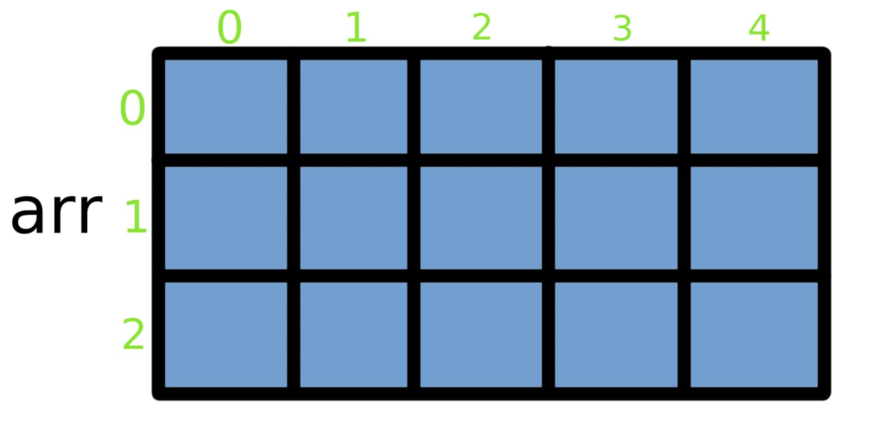
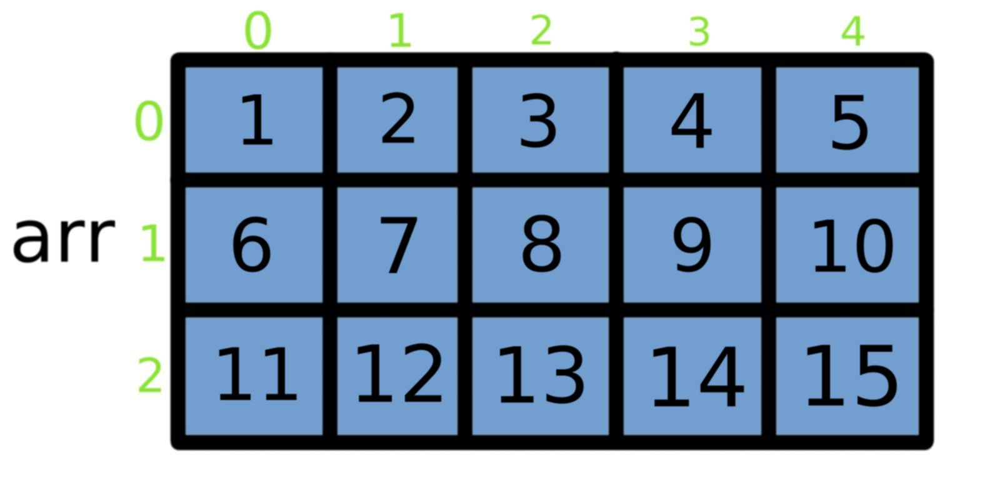
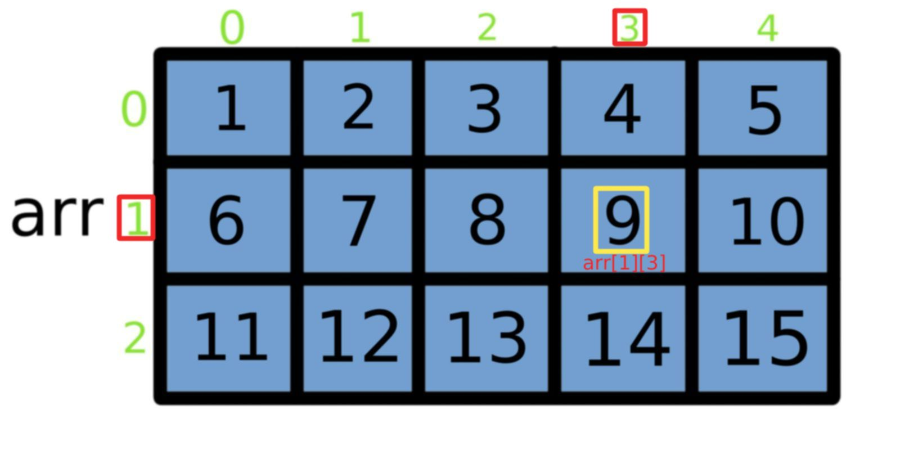

## Многомерни масиви (Multidimensional array)
Масивът е структурен (съставен) тип данни, представляващ крайна редица от еднотипни елементи с **пряк достъп до всеки елемент**.
**Многомерните масиви** обикновено се описват като **"масиви от масиви"**, но за да можем по-лесно да си го представим,
ще използваме двумерен масив, който прилича на таблица или матрица(като по алгебра :D).
Многомерните масиви, също като едномерните, са съставени от един и същ тип данни(int, char, double, и др.).



Това е двумерен масив, който на С++, може да се декларира така:
```c++
    int arr[3][5];
```
Този масив може да се разглежда като: **променлива(arr)** oт тип **int**, която съдържа ***3 масива от по 5 елемента***,
или **матрица с 3 реда и 5 колони(по-често)**.

### Декларане на масив
За изграждането на двумерен масив най-важното което, трябва да определим е **броят на елементите** му, **техният тип** и
**броят на редовете и колоните**. Например:
```c++    
    int arr[3][5]; - така декларираме масив от тип int с 3 реда и 5 колони(общо 15 елемента)
    double dArr[10][10]; - така декларираме масив от тип double с 10 реда и 10 колони(общо 100 елемента)
    char str[4][6]; - така декларираме масив от тип char с 4 реда и 6 колони(общо 24 елемента)
```
Броят на **редовете и колоните** може да бъде зададен и **чрез константи**, които са **предварително дефинирани**.
```c++
    const int ROWS = 3;
    const int COLUMNS = 5;
        ...
    int array[ROWS][COLUMNS];
```

### Инициализация на масиви
#### Първи начин:
#    
```c++
    int arr[2][2]; // два реда и две колони, общо 2 * 2 = 4 елемента
    arr[0][0] = 5;
    arr[0][1] = -3;                 //arr изглежда така: 5 -3
    arr[1][0] = 12;                 //                   12 6
    arr[1][1] = 6;
```

#### Втори начин:
#
```c++
    int arr[3][5] = {{1, 2, 3, 4, 5}, {6, 7, 8, 9, 10}, {11, 12, 13, 14, 15}};
```
Нагледно е това:



#### Втори начин':
Не е задължително да попълвате всички стойностти, както и да използвате вътрешните скоби за указване елементите на редовете. Въпреки че, някои компилатори ще ви позволят да пропуснете вътрешните скоби, ние силно препоръчваме да ги включите, така или иначе, както за целите на четливостта на кода, така и за начина, по който C++ ще замени липсващите стойности с 0.

```c++
int array[3][5] =
{
    { 1, 2  }, // row 0 = 1, 2, 0, 0, 0
    { 6, 7, 8 }, // row 1 = 6, 7, 8, 0, 0
    { 11, 12, 13, 14 } // row 2 = 11, 12, 13, 14, 0
};

```
#### Втори начин'':
Двумерните масиви с инициализиращи списъци от елементи, могат да **пропуснат само най-лявата** спецификация на дължината:
```c++
int array[][5] =
{
    { 1, 2, 3, 4, 5 },
    { 6, 7, 8, 9, 10 },
    { 11, 12, 13, 14, 15 }
};
```
Компилаторът може да разбере каква е дължината на масива. Въпреки това, **не се допуска** следното:
```c++
int array[][] =
{
    { 1, 2, 3, 4 },
    { 5, 6, 7, 8 }
};
```
#### Трети начин:
Можем да  инициализираме двумерен масив и със стойности, въведени от клавиатурата.
```c++
    double arr[3][5];
    for(int i = 0; i < 3; i++)  // имаме 3 реда
    {
        for(int j = 0; j < 5; j++) // и 5 колони
        {
            cin >> arr[i][j];
        }
    }
```
### Достъп до елемент
Достъпът до всеки елемент се осъщесвява, чрез индексирана променлива, в която са указани **името на масива** и **индексът**(поредният номер на елемента в масива) т.е. **номера на реда и на колоната, в която се намира елемента**, поставен в квадратни скоби.
```c++
    arr[1][3]; // индексирането в двумерни масиви, също е от 0 до броя на                     
                // елементите -1 в съответния ред или колона
```



### Допустими операции
Операции над цели двумерни масиви ***не са допустими***.

```c++
    int a[3][5], b[3][5];
    a = b;  // недопустима операция
```

### Въвеждане и извеждане на елементите на масив
#### Въвеждане:
#
```c++
    double arr[3][5];
    for(int i = 0; i < 3; i++)
    {
        for(int j = 0; j < 5; j++)
        {
            cout << "arr[ " << i << " ][ " << j << " ]= ";
            cin >> arr[i][j];
        }
    }
```

#### Извеждане:
#
```c++
    double arr[3][5];
        ...
    for(int i = 0; i < 3; i++)
    {
        for(int j = 0; j < 5; j++)
        {
            cout << "arr[ " << i << " ][ " << j << " ]= " << arr[i][j] << ' ';
        }
        cout << endl;
    }
```

### Подаване на масив като параметър на функция
#### Синтаксис за едномерен масив

	return_type/void <function_name>( <type> <name>[], <integer_type> <size>);

Пример:
```c++
int sumAllElementsInArray(int arr[], int size);
```
Извикването става, само с името на масива:
```c++
// somewhere in main()

	int my_arr[5] = {1, 2, 3, 4, 5};
	...
	cout << sumAllElementsInArray(my_arr, 5);
```
#### Синтаксис за двумерен масив

	return_type/void <function_name>( <type> <name>[][<maximum_size_of_columns>], <integer_type> <size_of_rows>, <integer_type> <size_of_columns>);

Пример:
```c++
int sumAllElementsInMatrix(int mrx[][10], int rowSize, int columnSize);
```
Извикването става, само с името на масива:
```c++
// somewhere in main()

	int my_mrx[3][3] = { {1, 2, 3}, {4, 5, 6}, {7, 8, 9} };
	...
	cout << sumAllElementsInMatrix(my_mrx, 3, 3);
```