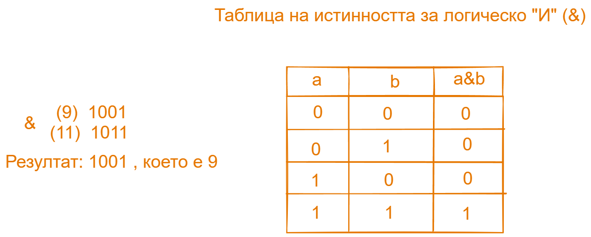
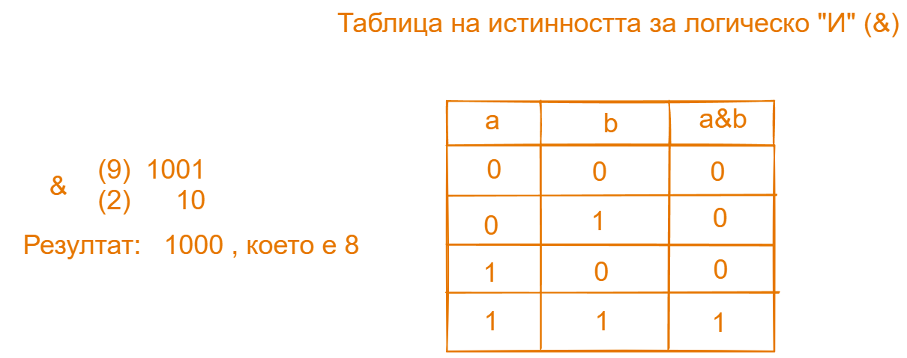

# <center> **Семинар по "Увод в програмирането"** </center>

## <center> **Рекурсия (част 2)** </center>

## 1. Brute Force (Брутална Сила)

Brute Force е метод за решаване на проблем чрез чиста изчислителна мощ, вместо да се използват техники за увеличаване на ефикастността, докато не се открие правилното решение на даден проблем. Пример за такъв алгоритъм би бил алгоритъм за отгатване на парола на акаунт.

## 2. Backtracking

Backtracking е техника в програмирането за решаване на алгоритмични задачи чрез рекурсия. Целта на такива алгоритми е да търси решение на проблем сред много възможности като обикновено това се случва като постепенно "се придвижваме напред" в решението, изолирайки тези състояния, които не удовлетворяват нашото решение. Стигайки до "път без изход" можем да се върнем назад и да пробваме различна алтернатива за решение. Алгоритъмът **Depth-First Search** e пример за backtracking алгоритъм, защото с него можем не само да обходим, но и да търсим определени стойности в матрици, графи и дървета, за последните две е още рано да говорим.

## Задача 1

Да се напише функция, която намира броя на различните пътища в лабиринт, зададен с двумерен масив. Ако няма такива пътища, функцията да връща 0.
Легенда:

^ - начална дестинация

0 - проходимо поле

1 - непроходимо поле

\# - непроходимо поле

\* - крайна дестинация

Пример:

Вход:

^ 0 0 0 0 0 0 1

0 1 1 1 1 1 0 0

0 0 0 0 0 1 # 1

0 1 1 1 0 1 0 0

0 1 0 1 0 0 0 1

0 0 0 1 0 1 0 \*

Изход : 1

## <center> **Побитови операции** </center>

Таблица с побитови операции:

| Operation | Description                 |
| --------- | --------------------------- |
| &         | Побитово "и"                |
| \|        | Побитово "или"              |
| ^         | Побитово изключващо "или"   |
| >>        | Побитово отместване надясно |
| <<        | Побитово отместване наляво  |
| ~         | Побитово отрицание          |

оператора за отрицание(~) е унарен, тоест работи само с един операнд. При подадено число N той връща -(N + 1)

## Как се пресмятат побитовите операции?

Използвайки таблицата на истинността за различните операции пресмятаме получения резултат като смятаме бит по бит и така образуваме новото число в двоична бройна система. Пресмятането започва от дясно на ляво.

Пример №1



Пример №2



```cpp
#include <iostream>

int main()
{
	int a = 21;// 10101
	int b = 47;//101111

	std::cout << (a & b) << std::endl;//5 -> 101
	std::cout << (a | b) << std::endl;//63 -> 111111
	std::cout << (a ^ b) << std::endl;//58 -> 111010
	std::cout << (a >> 2) << std::endl;//5 -> 101
	std::cout << (a << 2) << std::endl;//84 -> 1010100
	std::cout << (~a) << std::endl;//84 -> 1010100

	return 0;
}
```
