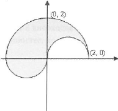

# Увод в програмирането семинар

## Задача 1

Дадено е едно число. Проверете дали има 1 в цифрите му.

    Вход: 
    234
    Изход: 
    NO

    Вход: 
    54321
    Изход: 
    YES

## Задача 2

Да се напише програма, която намира средно аритметичното на сумата от цифрите в десетичния запис на дадено естествено число.

## Задача 3.1

Да се провери дали въведено от потребителя число съдържа само четни цифри.

## Задача 3.2

Да се провери дали въведено от потребителя число съдържа поне една нечетна цифра.

## Задача 4

Да се напише програма, която по две подадени цели положителни числа **m** и **n** проверява дали **m** е префикс на **n**.

## Задача 5

Напишете програма, която по въведено нечетно число n, извежда успоредник заедно с две от височините му.

    n = 3:
      * * * * * *
     **       **
    * * * * * *

    n = 5:
        ​* * * * * * * * * *
       ​**             *  *     
      ​* *             * *
    ​ *  *             **
    * * * * * * * * * *

## Задача 6

Напишете програма, която по дадено естествено число N принтира таблицата за умножение до N.

Пример за вход 10:

    1    2       3       4       5       6       7       8       9       10
    2       4       6       8       10      12      14      16      18      20
    3       6       9       12      15      18      21      24      27      30
    4       8       12      16      20      24      28      32      36      40
    5       10      15      20      25      30      35      40      45      50
    6       12      18      24      30      36      42      48      54      60
    7       14      21      28      35      42      49      56      63      70
    8       16      24      32      40      48      56      64      72      80
    9       18      27      36      45      54      63      72      81      90
    10      20      30      40      50      60      70      80      90      100

## Задача 7

Напишете програма, която по дадено естествено число N принтира съкратена таблица за умножение в "долноотриъгълен вид" до N.

Пример за вход 10:

    1
    2       4
    3       6       9
    4       8       12      16
    5       10      15      20      25
    6       12      18      24      30      36
    7       14      21      28      35      42      49
    8       16      24      32      40      48      56      64
    9       18      27      36      45      54      63      72      81
    10      20      30      40      50      60      70      80      90      100

## Задача 8

Напишете програма, която по дадено естествено число N принтира съкратена таблица за умножение в "горнотриъгълен вид" до N.

Пример за вход 10:

    1       2       3       4       5       6       7       8       9       10
        4       6       8       10      12      14      16      18      20
            9       12      15      18      21      24      27      30
                16      20      24      28      32      36      40
                    25      30      35      40      45      50
                        36      42      48      54      60
                            49      56      63      70
                                64      72      80
                                    81      90
                                        100

## Задача 9

Валиден условен оператор ли е следната поредица символи:

1. `if (x < y) x = 0; else y = 0;`
2. `if (x > y) x = 0; else cin >> y;`
3. `if (x >= y) x = 0; y = 0; else cout << z;`
4. `if (x < y) ; else z = 5;`
5. `if (x < y < z) then z = z + 1;`
6. `if (x != y) z = z + 1; x = x + y;`

## Задача 10

Да се напише булев израз, който проверява дали точка (по дадени координати) е в оцветената зона на чертежа:

